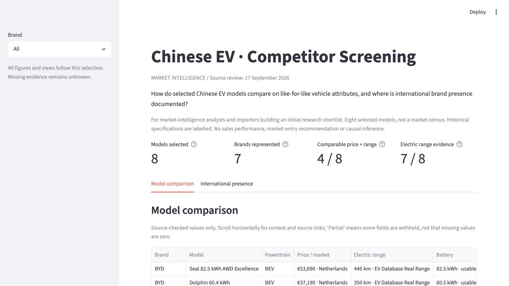
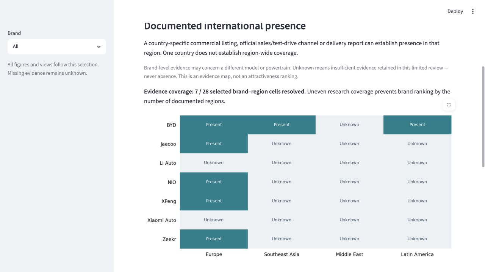

# Chinese EV Market Intelligence Dashboard

**A compact competitor-screening case: 8 selected models, 7 Chinese brands, transparent specifications and documented international presence.** Built with Python, pandas, Streamlit and Matplotlib. Source review: **17 September 2026**.

## Business question

**How do selected Chinese EV models compare on like-for-like vehicle attributes, and where is international brand presence documented?**

For a market-intelligence analyst or importer building an initial competitor research shortlist. The dashboard makes comparable listings and evidence gaps visible. It supports descriptive screening, not a market-entry decision, sales-performance analysis or causal explanation.

## At a glance

- **8 models / 7 brands:** BYD, Zeekr, XPeng, NIO, Li Auto, Xiaomi Auto and Jaecoo.
- **4/8 models** qualify for a Dutch listed-price / EV Database Real Range comparison.
- **7/8 models** have source-checked electric-range values; standards remain separate.
- **7/28 brand–region cells** have documented presence; the other 21 are **unknown, not absent**.

This preserves the original hand-curated portfolio selection. Its sampling rationale was not documented, so it is not a representative census or a complete current catalogue. Sources include historical variants and disclosures; the review date does not make every vehicle a 2026 model.

## Dashboard





The brand filter updates the KPI denominators, model table, comparison and presence matrix. Model details include powertrain, price market, range standard, capacity basis, verification status and direct source links. A second tab maps international presence with country-level evidence behind each resolved cell. Missing prices remain missing, and selections without comparable listings show an explanatory empty state.

## Why semantic comparability matters

- A BEV's electric range is different from an EREV's fuel-plus-electric total range.
- WLTP, CLTC and EV Database Real Range are not interchangeable.
- Usable and nominal battery capacity cannot silently share one average.
- A Dutch RRP is not a European-wide price; a Chinese price is not converted without an evidenced exchange-rate method.
- International presence is not market attractiveness, and an unknown region is not an absent brand.

The project keeps these dimensions separate. No composite score or mixed-standard range average is used.

## Verified observations

| Observation | Possible business relevance | Limitation |
|---|---|---|
| The selected Zeekr 001 lists 505 km Real Range at €55,990; the XPeng G6 lists 450 km at €48,990. Difference: 55 km and €7,000. | Investigate the price/range trade-off between these two Dutch listings. | Different vehicle formats, years and equipment; this is not a best-buy conclusion. |
| Four of eight selected models meet the common comparison rules, although five EUR prices are retained. | Separate a comparable shortlist from historical references and further research. | The Seal MY23-25 is historical; exclusion does not assess brand quality. |
| Five brands have country-level European presence evidence; BYD also has Thailand and Brazil evidence in this file. | Locate documented competitors and evidence gaps for follow-up. | Uneven research depth; one country is not a whole region. Counts must not rank brand strength. |

These observations follow the retained source snapshots, not measured sales, market share or investment outcomes.

## Methodology and sources

1. Manually review the original source links and retain only supported values; record context and review date.
2. Validate required fields, unique keys, metric definitions and brand coverage.
3. Join model rows to brand metadata without multiplying observations.
4. Compare only BEVs with a non-missing Dutch listed RRP, currently listed availability and EV Database Real Range.
5. Map brand–region evidence independently of model specifications; retain unknowns.

Vehicle evidence comes from five [EV Database listings](data/SOURCES.md), an official historical Xiaomi disclosure, the Australian JAECOO specification sheet and Li Auto's company profile. Li Auto's trim-specific numbers are withheld. International evidence uses country availability listings and official commercial/delivery sources. All source locators and decisions are in [the review log](data/SOURCES.md); definitions and KPI formulas are in [the data dictionary](data/README.md).

**Limitations:** small non-random selection; changing websites; mixed source dates and model years; unverified Li Auto trim; incomplete battery/price coverage; listing rather than transaction prices; unequal presence research. Brand-level evidence need not refer to the selected model or BEV powertrain. Third-party reuse permissions are not established as an open-data licence.

## Reproduce locally

Tested with **Python 3.14.4** and the versions in [requirements.txt](requirements.txt). No network access is needed at runtime. Dependencies are direct tested versions, not a fully locked environment.

From the repository root:

```bash
python3 -m venv .venv
source .venv/bin/activate
python -m pip install -r requirements.txt
python -m streamlit run dashboard/app.py
```

Starting from the `dashboard` directory also works:

```bash
cd dashboard
python -m streamlit run app.py
```

Run the focused regressions from the repository root:

```bash
python -m unittest discover -s tests -v
```

Execute and refresh the notebook from the repository root:

```bash
python -m nbconvert --to notebook --execute notebooks/01_data_cleaning.ipynb --inplace --ExecutePreprocessor.kernel_name=python3 --ExecutePreprocessor.timeout=120
```

The notebook can also be run top to bottom from its own directory with the same environment. It validates the curated CSV inputs and reproduces the analysis; it does not scrape websites or reconstruct historical source pages.

## Repository

```text
 dashboard/app.py                 Streamlit interface
 dashboard/data.py                Shared validation, comparison and KPI rules
 data/model_specs.csv             Eight selected model/variant records
 data/brands.csv                  Seven brand metadata records
 data/expansion_markets.csv        Brand × region evidence, legacy filename
 data/README.md                   Definitions and methodology
 data/SOURCES.md                  Source-review decisions and links
 notebooks/01_data_cleaning.ipynb  Executed validation and analytical walkthrough
 tests/test_dashboard.py          Focused data and filter regressions
 screenshots/                     Current app captures
 requirements.txt                 Tested direct dependencies
```

## Authorship and assistance

Original project and hand-curated dataset: **Oliver de Bruin**. The September 2026 portfolio repair used **OpenAI Codex assistance** for source checking, semantic corrections, implementation, documentation and tests. External publications are the evidence; AI is not a factual source. No independent vehicle testing or owner verification is claimed.

The repository retains its existing directory/GitHub name. No third-party data licence is granted by this project; consult original source terms before reuse.
